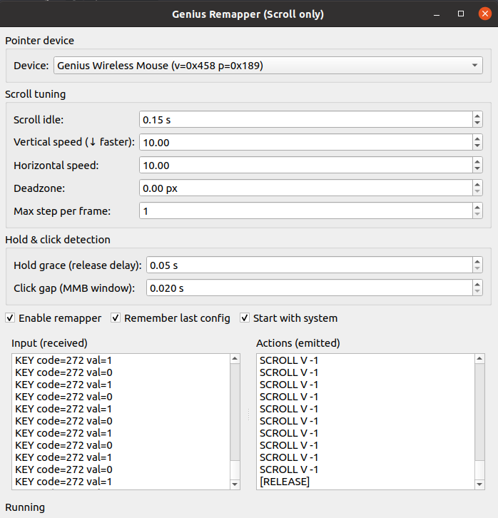
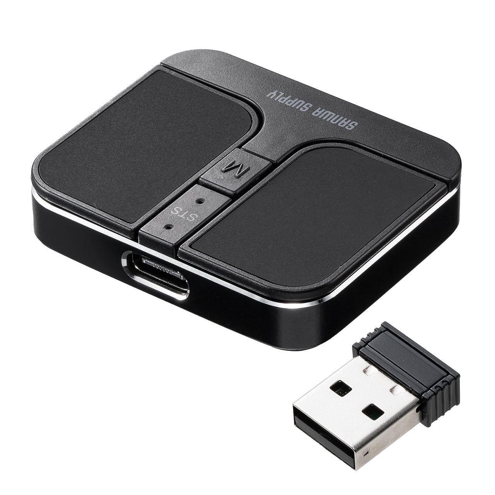

# Genius Mouse Scroll Remapper

A tiny two-file helper that remaps the Genius Wireless Mouse middle touch surface into a smooth scroll-only pad while still letting you trigger a middle-click through smart tick detection. The GUI is written in PyQt5 and wraps the `RemapperScroll` core which uses `evdev` + `uinput`.



## Requirements

```bash
sudo apt update
sudo apt install python3 python3-pip python3-evdev python3-pyqt5
```

> **Note:** You should add yourself to the `input` group to run app without `sudo`:
>
> ```bash
> sudo usermod -aG input "$USER"
> echo 'KERNEL=="uinput", GROUP="input", MODE="0660"' | sudo tee /etc/udev/rules.d/90-uinput.rules
> sudo udevadm control --reload-rules && sudo udevadm trigger
> ```
> Sign out/in afterwards.

## Running the App

```bash
python3 mouse_remapper_app.py
```

1. Pick your Genius mouse from the dropdown (it lists all pointer devices with relative axes).
2. Tune scroll speed, deadzone, hold grace, and click-gap values.
3. Click **Start** to grab the physical mouse and spawn the virtual one (`Genius-Remapped Mouse`).
4. Logs on the right show raw events and emitted actions; use them to verify MMB detection (`MMB CLICK`).

The tray icon tooltip mirrors your active parameters, and the “Start with system” checkbox writes a `.desktop` file under `~/.config/autostart` so the remapper launches automatically after login.

## Adding it to the Ubuntu application menu

Run the provided helper to copy the icon, create a `.desktop` file under `~/.local/share/applications`, and refresh the desktop database:

```bash
./install_desktop_entry.sh
```

The script grabs the absolute path to `mouse_remapper_app.py`, writes `~/.local/share/applications/genius-remapper.desktop`, and installs `assets/genius_remapper.svg` as `~/.local/share/icons/genius-remapper.svg`. After it finishes, search for “Genius Mouse Scroll Remapper” in *Show Applications* and pin it 
if desired.

## What problem does this solve?

Some modern (or “silent/mini”) mice **don’t have a real middle wheel/button**. Instead, they ship a **touch surface or a toggle** that only generates fixed-rate *wheel ticks* (auto-scroll) and **never reports a holdable button** (e.g., no `BTN_MIDDLE` press/release). 

On Linux this causes:
- **Jerky, constant-speed auto-scroll** you can’t control with mouse movement.  
- **No proportional scrolling** like a touchpad (faster hand motion → faster scroll).  
- **libinput / EmulateWheel don’t help** because they need a real “hold” button to convert movement into scroll.

**This app** grabs the physical device via `evdev`, creates a virtual mouse via `uinput`, and **maps “hold + move” into smooth, movement-proportional scroll**. It also stops **immediately** when you release the “hold” surface (using a short grace window to detect release even if the device sends no button-up).

### Typical symptoms (of affected mice)

- Tapping/holding the “middle” area **doesn’t produce `BTN_MIDDLE`**, only `REL_WHEEL` / `REL_WHEEL_HI_RES` ticks.
- While held, the mouse **auto-scrolls at a fixed speed**, regardless of how fast you move the mouse.
- You **cannot** enable classic “hold-to-scroll” with libinput because there’s **no holdable button** to bind.

### Examples of such mice (no physical wheel)



- **Sanwa Supply 400-MAWB216** (touch middle; fixed-speed auto-scroll) — [product page](https://direct.sanwa.co.jp/ItemPage/400-MAWB216BK)  
- Some **Genius Wireless Mouse** variants (e.g., vendor `0x0458`, product `0x0189`) that emit wheel ticks from the middle area instead of `BTN_MIDDLE`.

> The app is **brand-agnostic**: if your device shows up in `evdev` and exhibits these symptoms, select it in the dropdown and enable remapping.


## Troubleshooting

- **No devices listed** – Try to run `sudo python3 mouse_remapper_app.py`; If there are devices, ensure your user belongs to the `input` group (log out/in after adding). The launcher runs the app without `sudo`, so the `/dev/input/event*` files must be accessible to your user.
- **Virtual scroll stutters** – Lower `div_y` / `div_x` or increase `deadzone`.
- **Middle-click doesn’t trigger** – Increase the click gap toward `0.06` seconds if your firmware emits sparse ticks.

Happy scrolling!

---

**License:** MIT (see `LICENSE`).

**Credits:** Implementation authored with the assistance of OpenAI's GPT models.
